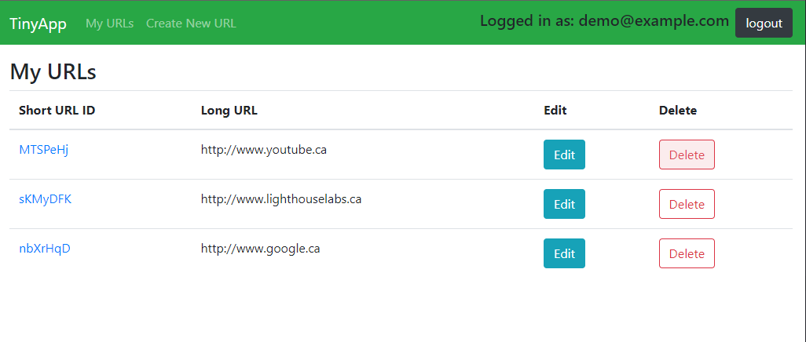
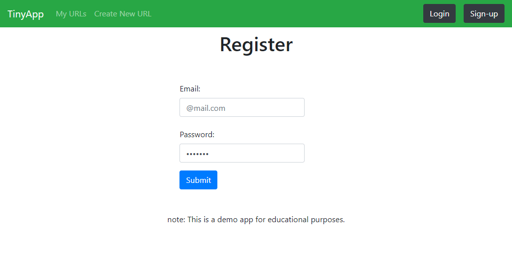

# TinyApp Project

TinyApp is a full stack web application built with Node and Express that allows users to shorten long URLs.
 This was a project done for educational purposes. 

## Final Product

## Dependencies

- Node.js
- Express
- EJS
- bcryptjs
- cookie-session
- nodemon (optional)

## Getting Started

- Install all dependencies (using the `npm install` command).
- Run the development web server using the `node express_server.js` command.